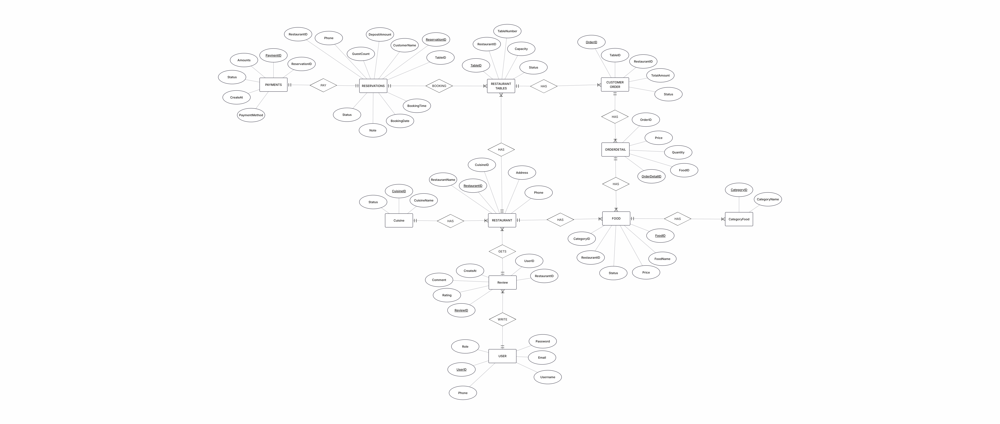

## ERD



## Database design
```sql 
use restaurant_booking;

/*TABLE USER*/
CREATE TABLE Users (
    UserID INT AUTO_INCREMENT PRIMARY KEY NOT NULL,
    Username VARCHAR(50) NOT NULL,
    Phone VARCHAR(11),
    Email VARCHAR (90),
    Password VARCHAR(50) NOT NULL,
    Role VARCHAR(50) NOT NULL
);

/*TABLE CUISINE*/
create table Cuisine(
CuisineID int AUTO_INCREMENT primary key NOT NULL,
CuisineName varchar(100) NOT NULL,
Status varchar(50)
);

/*TABLE Restaurant*/
CREATE TABLE Restaurant(
RestaurantID INT AUTO_INCREMENT PRIMARY KEY NOT NULL,
RestaurantName varchar(100) not null,
Address varchar(200),
Phone varchar(11),
Email varchar (100),
Opentime TIME,
Closetime TIME,
description varchar(500),
status varchar(50) not null, 
UserID int, /*ID của tài khoản sở hữu nhà hàng*/
CuisineID int,

FOREIGN KEY (CuisineID) REFERENCES Cuisine(CuisineID)
);

/*TABLE RestaurantTables*/
create table RestaurantTables(
TableID int AUTO_INCREMENT primary key NOT NULL,
RestaurantID INT NOT NULL,
TableNumber varchar(10) NOT NULL,
Capacity INT NOT NULL,
Status VARCHAR(50) NOT NULL DEFAULT 'Trống',

FOREIGN KEY (RestaurantID) REFERENCES Restaurant(RestaurantID)
);


/*TABLE Reservations*/
create table Reservations(
ReservationID int AUTO_INCREMENT PRIMARY KEY NOT NULL,
UserID varchar(100),
CustomerName varchar(100) NOT NULL,
phone varchar(11) NOT NULL,
RestaurantID int,
TableID int,
BookingDate DATE NOT NULL,
BookingTime TIME NOT NULL,
GuestCount int NOT NULL,
Deposit decimal(10,2) NOT NULL, /*số tiền cần đặt cọc*/
Note varchar(300),
Status varchar(50),

FOREIGN KEY (TableID) REFERENCES RestaurantTables(TableID)
);

/*TABLE CategoryFood*/
create table CategoryFood(
CategoryID int AUTO_INCREMENT primary key NOT NULL,
CategoryName varchar(100)
);

/*TABLE Food*/
create table Food(
FoodID varchar(8) primary key NOT NULL,
FoodName varchar(100) NOT NULL,
RestaurantID int,
Price decimal(10,2) NOT NULL,
CategoryID int,
Description varchar(255),
Status varchar(50) DEFAULT 'Còn Món',
Image_URL VARCHAR(255),

FOREIGN KEY (CategoryID) REFERENCES CategoryFood (CategoryID),
FOREIGN KEY (RestaurantID) REFERENCES Restaurant(RestaurantID)
);

/*TABLE ORDER*/
create table CustomerOrder(
OrderID int AUTO_INCREMENT primary key NOT NULL,
TableID int NOT NULL,
RestaurantID int,
TotalAmount decimal(10,2),
Status varchar(50),

FOREIGN KEY (TableID) REFERENCES restauranttables(TableID)
);

/*TABLE ORDER DETAIL*/
create table OrderDetail(
OrderDetailID int AUTO_INCREMENT primary key NOT NULL,
OrderID int,
FoodID varchar(8),
Quantity int,
Price decimal(10,2),

FOREIGN KEY (OrderID) REFERENCES CustomerOrder(OrderID),
FOREIGN KEY (FoodID) REFERENCES Food(FoodID)
);

/*TABLE PAYMENTS*/
CREATE TABLE Payments(
PaymentID int AUTO_INCREMENT primary key NOT NULL,
ReservationID int NOT NULL,
Amount DECIMAL(10,2), /*số tiền KH đã thanh toán*/
Status VARCHAR(50),
PaymentMethod VARCHAR(50),
CreatedAt DATETIME,

FOREIGN KEY (ReservationID) REFERENCES Reservations(ReservationID)
);


/*TABLE REVIEW*/
CREATE TABLE Reviews(
ReviewID int AUTO_INCREMENT primary key NOT NULL,
UserID INT NOT NULL,
RestaurantID INT NOT NULL,
Rating DECIMAL(2,1),
Comment VARCHAR(255),
CreateAt DATETIME,

FOREIGN KEY (UserID) REFERENCES users(UserID),
FOREIGN KEY (RestaurantID) REFERENCES restaurant(RestaurantID)
);
```sql

```md
## Insert sample data


/*USER*/
INSERT INTO Users (Username, Phone, Email, Password, Role)
VALUES ('admin', '0123456789', 'admin@gmail.com', '123456', 'ADMIN');
INSERT INTO Users (Username, Phone, Email, Password, Role)
VALUES ('restaurant1', '0987654321', 'res1@gmail.com', '1', 'STAFF');
INSERT INTO Users (Username, Phone, Email, Password, Role)
VALUES ('restaurant2', '0987654123', 'res2@gmail.com', '1', 'STAFF');

/*CUISINE*/
INSERT INTO Cuisine (CuisineName, Status)
VALUES
('Lẩu', 'Hoạt động'),
('Nướng', 'Hoạt động'),
('Hải sản', 'Hoạt động'),
('Chay', 'Hoạt động'),
('Hấp', 'Hoạt động');

/*Restaurant*/
INSERT INTO Restaurant
(RestaurantName, Address, Phone, Email, Opentime, Closetime, description, status, UserID, CuisineID)
VALUES
('Nhà Hàng Hotpot', '255 Nguyễn Văn Lượng, Phường An Phú Đông, TPHCM', '0901234567', 'hotpot@gmail.com',
'10:00', '22:00', 'Nhà hàng chuyên món lẩu', 'Đang hoạt động', 2, 1);
INSERT INTO Restaurant
(RestaurantName, Address, Phone, Email, Opentime, Closetime, description, status, UserID, CuisineID)
VALUES
('Nhà Hàng Grill House', '290 Võ Thị Sáu, Phường Xuân Hòa, TPHCM', '0982458100', 'grillhouse@gmail.com',
'9:00', '23:00', 'Nhà hàng chuyên món nướng', 'Đang hoạt động', 3, 2);

/*CATEGORY FOOD*/
INSERT INTO CategoryFood (CategoryName) 
VALUES ('Combo'), ('Nước uống'), ('Món nóng'), ('Món lạnh'), ('Thịt'), ('Hải Sản'), ('Tráng miệng'), ('Khai Vị');

/*FOOD*/
INSERT INTO Food (FoodID, FoodName, RestaurantID, Price, CategoryID, Description) 
VALUES
('LT', 'Lẩu Thái', 1, 50000, 3, 'Lẩu chua cay kiểu Thái với hải sản tươi và rau'),
('LM', 'Lẩu Mala', 1, 50000, 3, 'Lẩu cay tê đặc trưng Tứ Xuyên với nhiều loại topping'),
('LCD', 'Lẩu Cua Đồng', 1, 50000, 3, 'Lẩu cua đồng đậm vị truyền thống ăn kèm rau tươi'),
('LKC', 'Lẩu Kimchi', 1, 60000, 3, 'Lẩu kimchi Hàn Quốc cay nhẹ với thịt và đậu hũ'),
('LTX', 'Lẩu Tứ Xuyên', 1, 50000, 3, 'Lẩu cay nồng đậm vị tiêu hoa Tứ Xuyên'),
('LBNG', 'Lẩu Bò Nhúng Giấm', 1, 50000, 3, 'Thịt bò tươi nhúng giấm chua nhẹ ăn kèm rau'),
('STN', 'Set Thịt Nhỏ', 1, 120000, 1, 'Set thịt nhỏ gồm bò, heo và rau ăn kèm'),
('HSTH', 'Hải Sản Tổng Hợp', 1, 300000, 1, 'Combo hải sản gồm tôm, mực, nghêu tươi'),
('CBRN', 'Combo Rau Nấm', 1, 100000, 1, 'Combo rau và nấm tươi ăn kèm lẩu'),
('STL', 'Set Thịt Lớn', 1, 240000, 1, 'Set thịt lớn tẩm ướp đậm vị dùng với lẩu'),
('SVTL', 'Set Viên Thả Lẩu', 1, 80000, 1, 'Các loại viên thả lẩu như bò viên, cá viên'),
('BFTM', 'Buffet Tráng Miệng', 1, 45000, 7, 'Buffet trái cây và nước tráng miệng');

INSERT INTO Food (FoodID, FoodName, RestaurantID, Price, CategoryID, Description)
VALUES
('BCBM', 'Ba Chỉ Bò Mỹ', 2, 90000, 5, 'Thịt ba chỉ bò Mỹ mềm, thích hợp nướng hoặc nhúng lẩu'),
('LVB', 'Lõi Vai Bò', 2, 90000, 5, 'Phần lõi vai bò mềm, ít mỡ, nướng rất đậm vị'),
('THI', 'Thịt Heo Iberico', 2, 70000, 5, 'Thịt heo Iberico cao cấp, mềm ngọt tự nhiên'),
('KC', 'Kimchi', 2, 25000, 8, 'Kimchi cải thảo chua cay kiểu Hàn Quốc'),
('BTM', 'Bạch Tuộc Mini', 2, 85000, 6, 'Bạch tuộc mini tươi giòn thích hợp nướng'),
('SDMH', 'Sò Điệp Mỡ Hành', 2, 85000, 6, 'Sò điệp tươi nướng mỡ hành thơm béo'),
('SNMO', 'Sườn Non Ướp Mật Ong', 2, 120000, 5, 'Sườn non tẩm mật ong nướng thơm ngọt'),
('RSAK', 'Rau Sống Ăn Kèm', 2, 90000, 1, 'Rau sống tươi ăn kèm các món nướng'),
('CBN', 'Combo Nấm', 2, 100000, 1, 'Combo nhiều loại nấm tươi ăn kèm lẩu'),
('TNST', 'Tôm Nướng Sa Tế', 2, 240000, 6, 'Tôm tươi nướng sa tế cay thơm'),
('NVH', 'Nạc Vai Heo', 2, 100000, 5, 'Thịt nạc vai heo mềm, thích hợp nướng BBQ'),
('TCTH', 'Trái Cây Tổng Hợp', 2, 100000, 7, 'Đĩa trái cây tươi theo mùa tráng miệng');

/*TABLE*/
INSERT INTO restauranttables (RestaurantID, TableNumber, capacity)
VALUES
(1, 'Ban 1', 4),
(1, 'Ban 2', 4),
(1, 'Ban 3', 4),
(1, 'Ban 4', 6),
(1, 'Ban 5', 4),
(1, 'Ban 6', 6),
(1, 'Ban 7', 4),
(1, 'Ban 8', 8),
(1, 'Ban 9', 4),
(1, 'Ban 10', 4),
(1, 'Ban 11', 4),
(1, 'Ban 12', 4),
(1, 'Ban 13', 6),
(1, 'Ban 14', 4),
(1, 'Ban 15', 4),
(1, 'Ban 16', 4),
(1, 'Ban 17', 8);

INSERT INTO restauranttables (RestaurantID, TableNumber, capacity)
VALUES
(2, 'Ban 1', 4),
(2, 'Ban 2', 4),
(2, 'Ban 3', 4),
(2, 'Ban 4', 6),
(2, 'Ban 5', 4),
(2, 'Ban 6', 6),
(2, 'Ban 7', 4),
(2, 'Ban 8', 8),
(2, 'Ban 9', 4),
(2, 'Ban 10', 4),
(2, 'Ban 11', 4),
(2, 'Ban 12', 4),
(2, 'Ban 13', 6),
(2, 'Ban 14', 4),
(2, 'Ban 15', 4),
(2, 'Ban 16', 4),
(2, 'Ban 17', 8);

```sql
