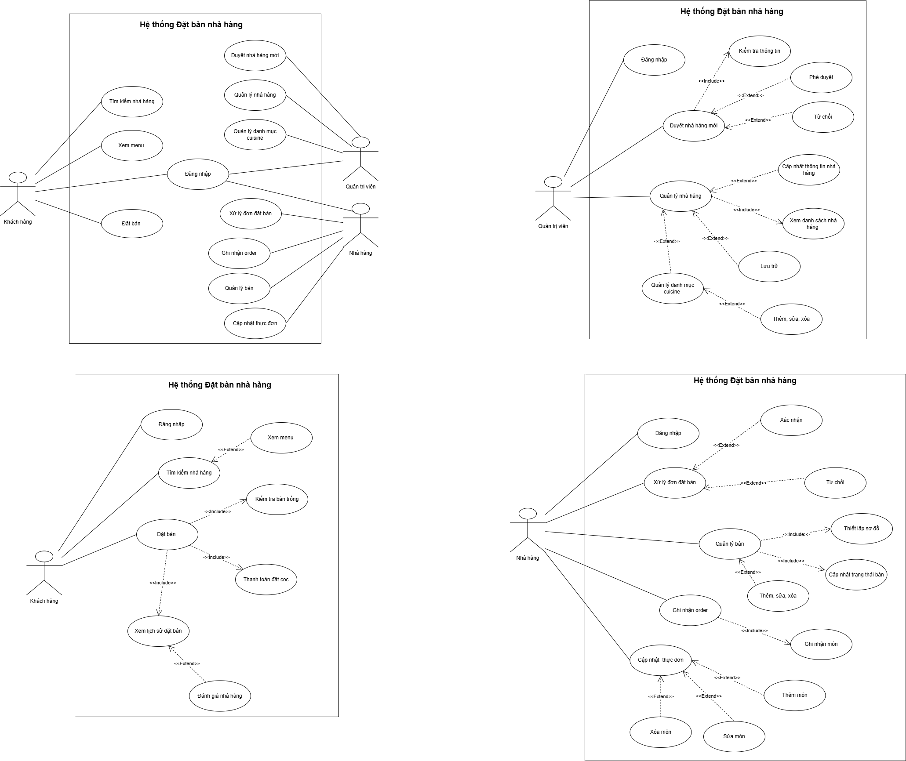

##Phân tích yêu cầu Hệ Thống Đặt Bàn Nhà Hàng:
1. Nhóm Khách hàng (End User)
- Tính năng 1 (CHÍNH): Đặt bàn trực tuyến.
Mô tả: Khách hàng nhập tên, số điện thoại, chọn nhà hàng, chọn ngày, giờ, số lượng người, bàn, và thực hiện đặt cọc.
Các luồng xử lý: Hệ thống kiểm tra tính khả dụng của bàn (số chỗ còn trống) tại thời điểm đó. Nếu hợp lệ, chuyển sang bước thanh toán đặt cọc. Sau khi thanh toán, lưu thông tin vào DB và thông báo cho nhà hàng.
Dữ liệu cần lưu: Tên KH, số điện thoại KH, Tên nhà hàng, thời gian, số khách, số tiền cọc, trạng thái (Chờ xác nhận).
- Tính năng 2 (Phụ): Tìm kiếm và Lọc nhà hàng.
Mô tả: Khách hàng tìm kiếm quán ăn phù hợp với nhu cầu.
Các luồng xử lý: Cho phép nhập từ khóa tìm kiếm theo tên quán/địa chỉ. Cho phép lọc theo loại hình ẩm thực (Cuisine) và xem thông tin menu/giá cả trước khi quyết định.
- Tính năng 3 (Phụ): Quản lý lịch sử đặt bàn & Đánh giá.
Mô tả: Xem lại các đơn đặt bàn cũ và để lại phản hồi.
Các luồng xử lý: Hiển thị danh sách các đơn đặt bàn (Đã xong, Đã hủy, Chờ xác nhận). Nếu đơn đã hoàn tất, khách hàng có thể viết bình luận.
2. Nhóm Nhà hàng (Business User)
- Tính năng 4 (CHÍNH): Xử lý đơn đặt bàn (Confirm/Reject).
Mô tả: Tiếp nhận và phản hồi yêu cầu từ khách hàng.
Các luồng xử lý: Khi có khách đặt, nhà hàng nhận thông báo. Nhà hàng kiểm tra thực tế và bấm "Xác nhận" để giữ chỗ hoặc "Từ chối" nếu hết chỗ.
- Tính năng 5 (Phụ): Quản lý Thực đơn (Menu CRUD).
Mô tả: Cho phép quản lý và cập nhật thông tin các món ăn trong thực đơn của từng nhà hàng trên hệ thống. Mỗi tài khoản nhà hàng sẽ có một thực đơn riêng biệt để quản lý các món ăn mà nhà hàng đó cung cấp.
Các luồng xử lý: 
Thêm món mới: Nhà hàng thêm món ăn mới vào thực đơn, bao gồm tên món, giá, mô tả và hình ảnh minh họa.
Cập nhật thông tin món: Chỉnh sửa thông tin món ăn như tên món, giá bán, mô tả hoặc hình ảnh.
Xóa món: Xóa các món không còn phục vụ khỏi thực đơn.
Hiển thị thực đơn theo nhà hàng: Mỗi tài khoản nhà hàng chỉ có thể xem và quản lý thực đơn của chính nhà hàng mình.
- Tính năng 6 (Phụ): Quản lý Sơ đồ bàn/Trạng thái bàn.
Mô tả: Theo dõi tình trạng chỗ ngồi tại quán.
Các luồng xử lý: Thiết lập tổng số lượng bàn/chỗ ngồi. Cập nhật trạng thái thủ công cho các bàn (Đang có khách, Bàn trống) để hệ thống tự động điều phối lượt đặt trực tuyến.
- Tính năng 7 (Phụ): Order
Cho phép nhân viên nhà hàng tạo đơn món ăn cho bàn của khách khi khách đến dùng bữa. Nhân viên có thể chọn món từ thực đơn, nhập số lượng và hệ thống sẽ tự động tính tổng tiền cho đơn hàng.
Các luồng xử lý:
Nhân viên chọn bàn cần order.
Nhân viên chọn món ăn từ danh sách thực đơn và nhập số lượng.
Nhấn Thêm để thêm món vào danh sách order.
Có thể xóa món nếu khách thay đổi yêu cầu.
Hệ thống hiển thị danh sách món đã chọn, bao gồm: tên món, số lượng, đơn giá và thành tiền.
Hệ thống tự động tính thuế, tiền đặt cọc và tổng thanh toán.
Sau khi hoàn tất, nhân viên có thể xác nhận thanh toán hoặc đóng đơn.
- Tính năng 8 (Phụ): Thanh toán
Mô tả: Sau khi khách hàng dùng bữa và nhân viên xác nhận  thanh toán trực tiếp tại nhà hàng, hệ thống sẽ cập nhật trạng thái đơn hàng thành Đã thanh toán / Đã hoàn tất.
Các luồng xử lý:
Nhân viên nhà hàng xác nhận khách đã thanh toán.
Hệ thống hiển thị thông báo xác nhận thanh toán thành công.
Trạng thái đơn được cập nhật thành Đã hoàn tất.
Khách hàng có thể xem lại hóa đơn trong lịch sử đặt bàn và thực hiện đánh giá nhà hàng.

3. Nhóm Quản trị viên (Admin)
- Tính năng 9 (CHÍNH): Phê duyệt và Quản lý Nhà hàng mới.
Mô tả: Kiểm soát các đối tác tham gia hệ thống để đảm bảo an ninh.
Các luồng xử lý: Khi có nhà hàng đăng ký, Admin kiểm tra hồ sơ và bấm "Duyệt". Chỉ những nhà hàng đã được duyệt mới hiển thị trên ứng dụng của khách hàng.
- Tính năng 10 (Phụ): Quản lý Danh mục (Cuisine Management).
Mô tả: Quản lý các loại hình ẩm thực chung của hệ thống.
Các luồng xử lý: Admin thực hiện CRUD (Thêm/Sửa/Xóa) các danh mục như: Đồ nướng, Lẩu, Sushi, Món chay... để nhà hàng lựa chọn khi đăng ký.
- Tính năng 11: Quản lý nhà hàng (CRUD)
Mô tả: Kiểm soát toàn bộ danh sách nhà hàng đang hoạt động.
Các luồng xử lý:
Create: Admin có thể tạo nhanh tài khoản cho các chuỗi nhà hàng lớn.
Read: Xem danh sách: Nhà hàng đang hoạt động, Nhà hàng bị khóa (do vi phạm hoặc nợ phí cọc), Nhà hàng chờ duyệt.
Update: Thay đổi trạng thái (Active/Inactive), thay đổi mức phí đặt cọc tối thiểu mà nhà hàng đó được phép áp dụng.
Delete: Chuyển sang chế độ "Lưu trữ" (Soft Delete) để không làm mất dữ liệu lịch sử các đơn đặt bàn cũ.

## Use Case Diagram

## UI Design
Figma Prototype:
https://www.figma.com/design/zlUuhx879LFgHwYiWKJlU3/Untitled?node-id=0-1&t=I9brvVp6gYDYtARN-1
 
 

