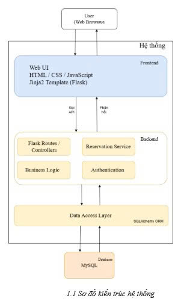

## KIẾN TRÚC
HỆ THỐNG ĐẶT BÀN NHÀ HÀNG
## 1. Tổng quan kiến trúc
Hệ thống đặt bàn nhà hàng được xây dựng dựa trên mô hình Three-Tier Architecture (kiến trúc 3 tầng). Mô hình này giúp tách hệ thống thành các phần riêng biệt để dễ phát triển, bảo trì và mở rộng sau này.
Tầng giao diện (Frontend / Presentation Layer)
Đây là phần người dùng tương tác trực tiếp thông qua trình duyệt web. Tại đây hiển thị các trang như trang chủ, trang tìm kiếm nhà hàng, trang đặt bàn, đăng nhập và quản lý đơn đặt bàn. Người dùng thực hiện các thao tác trên giao diện và gửi yêu cầu đến hệ thống.
Tầng xử lý nghiệp vụ (Backend )
Tầng này xử lý các logic nghiệp vụ của hệ thống, bao gồm quản lý đặt bàn, kiểm tra bàn trống, xác thực người dùng và xử lý dữ liệu trước khi lưu vào cơ sở dữ liệu.
Xử lý request từ người dùng
Kiểm tra logic nghiệp vụ
Kiểm tra tính hợp lệ dữ liệu
Gọi dữ liệu từ database
Tầng dữ liệu (Data Layer)
Đây là tầng chịu trách nhiệm lưu trữ và truy xuất dữ liệu từ cơ sở dữ liệu như thông tin khách hàng, bàn, đơn đặt bàn và thực đơn.
Hệ thống backend được xây dựng bằng ngôn ngữ Python sử dụng framework Flask, phát triển trên IDE PyCharm, và sử dụng MySQL làm hệ quản trị cơ sở dữ liệu.
## 2. Sơ đồ kiến trúc tổng thể

Trong kiến trúc này:
Người dùng (khách hàng, nhà hàng, admin) gửi yêu cầu thông qua giao diện web.
Yêu cầu được gửi tới Flask Server thông qua các API.
Backend xử lý logic nghiệp vụ như kiểm tra bàn trống, xác nhận đặt bàn, quản lý menu.
Backend truy vấn hoặc cập nhật dữ liệu trong MySQL Database.
Kết quả được trả về giao diện người dùng.
## 3. Tầng giao diện (Presentation Layer)
Tầng giao diện là nơi người dùng tương tác trực tiếp với hệ thống thông qua trình duyệt web.
Công nghệ sử dụng: HTML, CSS, JavaScript, Jinja2 Template Engine
Các giao diện chính của hệ thống:
Khách hàng có thể thực hiện các chức năng :
- Đăng nhập / đăng ký tài khoản
- Xem trang chủ
- Tìm kiếm nhà hàng
- Xem menu
- Đặt bàn
- Thanh toán tiền đặt cọc
- Xem lịch sử đặt bàn
- Viết đánh giá sau khi sử dụng dịch vụ
Giao diện của nhà hàng bao gồm: 
- Xác nhận hoặc từ chối đơn đặt bàn
- Quản lý danh mục ẩm thực (Cuisine)
- Quản lý thực đơn (thêm, sửa, xóa món)
- Quản lý sơ đồ bàn
- Tạo order món ăn cho khách
- Thanh toán hóa đơn
Giao diện quản trị viên bao gồm
- Phê duyệt nhà hàng
- Phê duyệt nhà hàng đăng ký
- Quản lý danh sách nhà hàng
- Quản lý danh mục ẩm thực
- Cập nhật trạng thái hoạt động của nhà hàng
Tầng này gửi yêu cầu HTTP đến server Flask và hiển thị dữ liệu trả về cho người dùng.
## 4. Tầng xử lý nghiệp vụ (Application Layer)
Tầng xử lý nghiệp vụ là thành phần trung tâm của hệ thống, tầng này được xây dựng bằng framework Flask và chịu trách nhiệm xử lý các yêu cầu từ người dùng và thực hiện các logic nghiệp vụ của hệ thống.
Trong Flask, tầng này được chia thành:
- Routes
- Services
- Authentication

Các thành phần chính:

4.1. Routes (Định tuyến)
Routes chịu trách nhiệm nhận các yêu cầu HTTP từ client và chuyển đến các hàm xử lý tương ứng.
Ví dụ:
/restaurants
/restaurants/<id>
/booking
/my-bookings
/login
/register
Mỗi route tương ứng với một hàm xử lý trong Flask, nhận dữ liệu từ request và trả về response cho người dùng.

4.2. Business Logic
Đây là phần xử lý các quy tắc nghiệp vụ quan trọng của hệ thống.
Module quản lý đặt bàn (Reservation Module): Chịu trách nhiệm xử lý chức năng đặt bàn trực tuyến của khách hàng.
Các xử lý chính:
- Kiểm tra bàn trống
- Kiểm tra thời gian đặt bàn
- Lưu thông tin đặt bàn
- Cập nhật trạng thái đơn đặt bàn
- Thông báo cho nhà hàng khi có đơn mới
Module tìm kiếm và lọc nhà hàng
Cho phép khách hàng:
- Tìm kiếm nhà hàng theo tên hoặc địa chỉ
- Lọc theo loại hình ẩm thực (Cuisine)
- Xem thông tin menu và giá cả tìm kiếm và lọc nhà hàng
Module quản lý thực đơn: Cho phép nhà hàng quản lý thực đơn riêng của mình.
Các chức năng:
- Thêm món ăn mới
- Cập nhật thông tin món
- Xóa món khỏi thực đơn
- Hiển thị danh sách món theo nhà hàng
Module quản lý bàn
Chức năng:
- Thiết lập số lượng bàn
- Quản lý trạng thái bàn
- Theo dõi bàn trống / bàn đang có khách
Module này giúp hệ thống xác định bàn khả dụng khi khách đặt bàn.
Module Order món ăn: Được sử dụng bởi nhân viên nhà hàng khi khách đến dùng bữa.
Các chức năng:
- Chọn bàn cần order
- Chọn món ăn từ menu
- Nhập số lượng món
- Tính tổng tiền đơn hàng
- Cho phép chỉnh sửa hoặc xóa món
- Cho Hệ thống tự động tính:
- Tổng tiền món
- Thuế
- Trừ tiền đặt cọc
- Tổng thanh toán cuối cùng
Module quản trị hệ thống: Dành cho quản trị viên hệ thống.
Chức năng:
- Phê duyệt nhà hàng đăng ký
- Quản lý danh mục ẩm thực (Cuisine)
- Quản lý danh sách nhà hàng
- Thay đổi trạng thái nhà hàng
- Lưu trữ nhà hàng bị xóa (Soft Delete)
4.3. Authentication
Hệ thống sử dụng xác thực người dùng để đảm bảo bảo mật.
Các chức năng bao gồm:
- Đăng ký tài khoản
- Đăng nhập
- Đăng xuất
Các role trong hệ thống:
- Customer :khách hàng đặt bàn
- Restaurant : nhà hàng quản lý dịch vụ của mình
- Admin : quản trị viên hệ thống
Có thể sử dụng: Flask-Login, Flask-Session để quản lý phiên đăng nhập.

## 5. Tầng dữ liệu (Data Layer)
Tầng dữ liệu chịu trách nhiệm lưu trữ và quản lý toàn bộ thông tin của hệ thống. Dữ liệu được lưu trong MySQL và backend Flask sẽ tương tác với cơ sở dữ liệu thông qua SQLAlchemy ORM để thực hiện các thao tác truy vấn, thêm, sửa và xóa dữ liệu.
Cơ sở dữ liệu của hệ thống bao gồm các bảng chính sau:
Các bảng dữ liệu chính bao gồm:
- Để lưu thông tin người dùng
Users (UserID, Name, Phone, Email, Password, Role).
- RestaurantTables lưu thông tin bàn trong nhà hàng.
RestaurantTables (TableId, TableNumber, RestaurantId, Capacity, Status)
- Restaurant lưu thông tin nhà hàng 
Restaurant ( RestaurantID, RestaurantName, Address, CuisineId, Description, status, OpenTime, CloseTime, UserID, RPhone, Email).
- Reservations lưu thông tin đặt bàn.
Reservations  (ReservationId, UserId, CustomerName, CustPhone, RestaurantId, TableId, datetime, GuestCount, Deposit, Status, Note).
- Cuisine lưu thông tin loại ẩm thực nhà hàng. 
Cuisine ( CuisineId, CuisineName, status)
- Food lưu thông tin thực đơn của nhà hàng.
Food ( FoodID, RestauranId, FoodName, CategoryID, Price, Description,Status, Image).
- CategoryFood Loại món ăn của thực đơn
CategoryFood(CategoryID, CategoryName)
- CustomerOrder lưu thông tin order.
CustomerOrder ( OrderId, TableID, RestaurantID,TotalAmount, status)
- Order Detail thông tin các món được gọi.
Order Detail( OrderDetailId ,Orderid, FoodID, quantity, price).
- Payments lưu thông tin đặt cọc
Payments( PaymentId, ReservationId, Amount, Status, PaymentMethod, CreatedAt).
- Reviews lưu thông tin đánh giá của khách hàng.
Reviews ( ReviewId, UsersID, RestaurantId, Rating, Comment, Createdat)
Flask tương tác với database thông qua thư viện ORM như SQLAlchemy để thực hiện các thao tác truy vấn và cập nhật dữ liệu.

## 6.  Luồng hoạt động của hệ thống (Ví dụ đặt bàn)
Quy trình đặt bàn diễn ra như sau:
Bước 1: Người dùng truy cập website và tìm kiếm nhà hàng theo: tên, địa chỉ, cuisine
Bước 2: Khách hàng nhập Tên, số điện thoại và chọn ngày, giờ và số lượng người.
Bước 3: Hệ thống kiểm tra: bàn trống, sức chứa bàn, thời gian đặt hợp lệ
Bước 4: Khách hàng thực hiện đặt cọc
Bước 5: Hệ thống lưu thông tin vào database với trạng thái đang chờ xác nhận
Bước 6: Nhà hàng nhận thông báo và tiến hành xác nhận (Confirm) hoặc từ chối (Reject).
Bước7: Khách đến ăn nhân viên tạo order và thanh toán.
Bước 9: Hệ thống cập nhật trạng thái đơn đặt bàn và sau đó khách hàng có thể tiến hành viết  đánh giá 

## 7. Công nghệ sử dụng
| Thành phần            | Công nghệ                |
|-----------------------|--------------------------|
| Ngôn ngữ lập trình    | Python                   |
| Framework Backend     | Flask                    |
| IDE                   | PyCharm                  |
| Frontend              | HTML, CSS, JavaScript    |
| Database              | MySQL                    |
| Authentication        | Flask-Login              |
| Version Control       | GitHub                   |

## TEST PLAN
HỆ THỐNG ĐẶT BÀN NHÀ HÀNG
## 1. Introduction
Tài liệu này mô tả kế hoạch kiểm thử cho hệ thống đặt bàn nhà hàng. Mục đích của tài liệu là xác định cách tiếp cận tổng thể cho quá trình kiểm thử nhằm đảm bảo hệ thống hoạt động đúng yêu cầu và có chất lượng ổn định trước khi được đưa vào sử dụng.
Test Strategy đóng vai trò định hướng cho các hoạt động kiểm thử trong dự án. Tài liệu này mô tả phạm vi kiểm thử, các cấp độ kiểm thử, loại kiểm thử được áp dụng, môi trường kiểm thử cũng như các công cụ hỗ trợ kiểm thử.
Các tài liệu chi tiết hơn như Test Case, Test Report và Bug Report sẽ được xây dựng dựa trên chiến lược kiểm thử được mô tả trong tài liệu này.
## 2. Scope of Testing
2.1. In Scope
Phạm vi kiểm thử bao gồm các chức năng chính của hệ thống đặt bàn nhà hàng dành cho khách hàng, nhà hàng và quản trị viên. Các chức năng này sẽ được tiến hành kiểm tra nhằm đảm bảo hệ thống hoạt động đúng yêu cầu và đáp ứng nhu cầu sử dụng.
2.1.1. Chức năng dành cho khách hàng
- Đăng ký và đăng nhập tài khoản
- Tìm kiếm nhà hàng
- Xem thông tin nhà hàng và thực đơn
- Kiểm tra bàn trống.
- Thực hiện đặt bàn (chọn ngày, giờ, số lượng khách).
- Thanh toán tiền đặt cọc
- Xem lịch sử đặt bàn
- Đánh giá nhà hàng sau khi sử dụng dịch vụ
2.1.2. Chức năng dành cho nhà hàng
- Đăng nhập hệ thống
- Xác nhận hoặc từ chối đơn đặt bàn
- Quản lý bàn trong nhà hàng
- Cập nhật thực đơn
- Ghi nhận order món ăn
2.1.3. Chức năng dành cho quản trị viên
- Đăng nhập hệ thống quản trị
- Phê duyệt nhà hàng mới đăng ký
- Quản lý danh sách nhà hàng
- Quản lý danh mục ẩm thực (Cuisine)
Các chức năng trên sẽ được kiểm thử để đảm bảo hệ thống hoạt động đúng theo yêu cầu và hỗ trợ người dùng thực hiện các thao tác một cách thuận tiện.
2.2. Out of Scope
Các chức năng sau không nằm trong phạm vi kiểm thử của hệ thống:
- Tích hợp với cổng thanh toán bên thứ ba như VNPay, MoMo hoặc PayPal.
- Kiểm thử các dịch vụ bên ngoài hệ thống.
- Kiểm thử ứng dụng mobile, vì hệ thống chỉ được phát triển dưới dạng ứng dụng web.
- Kiểm thử hạ tầng triển khai thực tế.
3. Test Objectives
Mục tiêu của hoạt động kiểm thử là đảm bảo rằng hệ thống đặt bàn nhà hàng hoạt động chính xác, ổn định và đáp ứng các yêu cầu chức năng cũng như yêu cầu của người dùng. Việc kiểm thử nhằm phát hiện và khắc phục các lỗi trong hệ thống trước khi hệ thống được triển khai và sử dụng thực tế.
Cụ thể, hoạt động kiểm thử của hệ thống hướng đến các mục tiêu sau:
- Đảm bảo  các chức năng chính của hệ thống hoạt động đúng theo yêu cầu đã thiết kế.
- Phát hiện các lỗi trong quá trình xử lý dữ liệu và tương tác giữa các thành phần của hệ thống.
- Đảm bảo dữ liệu được lưu trữ và xử lý chính xác trong cơ sở dữ liệu.
- Kiểm tra tính ổn định của hệ thống khi người dùng thực hiện các thao tác khác nhau.
- Đánh giá tính dễ sử dụng của giao diện người dùng để đảm bảo người dùng có thể thực hiện việc đặt bàn một cách thuận tiện.
- Đảm bảo rằng hệ thống có thể hoạt động ổn định trong môi trường triển khai đã xác định.
Thông qua quá trình kiểm thử, nhóm phát triển có thể cải thiện chất lượng hệ thống, giảm thiểu lỗi và đảm bảo hệ thống đáp ứng được nhu cầu sử dụng của người dùng.
## 4. Test Approach
4.1. Các Kỹ thuật kiểm thử 
Đối với hệ thống đặt bàn nhà hàng, quá trình kiểm thử được thực hiện dựa trên kiểm thử hộp đen (Black-box Testing) với một số kỹ thuật kỹ thuật kiểm thử phổ biến là phân vùng tương đương, phân tích giá trị biên, và kiểm thử thăm dò.
4.1.1. Phân vùng tương đương
Kỹ thuật trong đó dữ liệu đầu vào được chia thành các nhóm giá trị tương đương. Các giá trị trong cùng một nhóm được giả định sẽ được hệ thống xử lý giống nhau, do đó tester chỉ cần chọn một giá trị đại diện từ mỗi nhóm để kiểm thử.
Trong hệ thống, kỹ thuật này có thể được áp dụng cho các trường hợp như:
- Số lượng khách khi đặt bàn
- Thời gian đặt bàn
- Tên nhà hàng khi tìm kiếm
- Nội dung đánh giá nhà hàng
Việc áp dụng kỹ thuật Equivalence Partitioning giúp giảm số lượng test case cần thiết nhưng vẫn đảm bảo khả năng phát hiện lỗi.
4.1.2.  Phân tích giá trị biên
Kiểm thử tập trung vào các giá trị nằm ở ranh giới của dữ liệu đầu vào, vì đây thường là những vị trí dễ xảy ra lỗi trong hệ thống.
Trong hệ thống đặt bàn nhà hàng, kỹ thuật này có thể được áp dụng cho các trường như:
- Số lượng khách
- Thời gian đặt bàn
- Số lượng bàn trong nhà hàng
- Độ dài tên hoặc mô tả của nhà hàng
4.1.3. Kiểm thử thăm dò
Kỹ thuật vừa khám phá hệ thống vừa thực hiện kiểm thử mà không cần phải tuân theo các test case được thiết kế sẵn một cách cứng nhắc.
4.2. Cấp độ kiểm thử 
Các cấp độ kiểm thử được áp dụng bao gồm Unit Testing, Integration Testing, System Testing và User Acceptance Testing
4.2.1. Unit Testing 
Unit Testing là cấp độ kiểm thử thấp nhất, tập trung kiểm tra các thành phần nhỏ nhất của hệ thống như các hàm, module hoặc lớp trong chương trình. Mục tiêu của Unit Testing là đảm bảo từng đơn vị chức năng hoạt động chính xác theo thiết kế trước khi được kết hợp với các thành phần khác.
Trong hệ thống đặt bàn nhà hàng, Unit Testing được áp dụng cho các chức năng quan trọng trong backend, chẳng hạn như:
- Xác thực đăng nhập người dùng
- Xử lý logic tìm kiếm nhà hàng
- Kiểm tra logic đặt bàn
- Kiểm tra điều kiện đặt bàn
- Tạo và cập nhật thông tin đặt bàn
- Xử lý dữ liệu trước khi lưu vào database
- Các kiểm thử này có thể được thực hiện bằng thư viện PyTest.
4.2.2. Integration Testing 
Integration Testing nhằm kiểm tra sự tương tác giữa các module trong hệ thống sau khi các module đã được kiểm thử riêng lẻ. Mục tiêu của cấp độ kiểm thử này là đảm bảo các module có thể hoạt động cùng nhau một cách chính xác và dữ liệu được truyền giữa các module đúng như mong đợi.
Trong hệ thống đặt bàn nhà hàng, Integration Testing tập trung vào các luồng chức năng chính như:
- Tích hợp giữa module tìm kiếm nhà hàng và module xem thông tin nhà hàng
- Tích hợp giữa module đặt bàn và module kiểm tra bàn trống
- Tích hợp giữa module đặt bàn và cơ sở dữ liệu lưu trữ thông tin đặt bàn
- Tích hợp giữa module quản lý nhà hàng và cơ sở dữ liệu
- Tích hợp giữa module quản lý thực đơn và hệ thống hiển thị menu cho khách hàng
- Tương tác giữa Flask routes và business logic
- Tương tác giữa API backend và giao diện người dùng
Integration Testing giúp phát hiện các lỗi liên quan đến giao tiếp giữa các module, đặc biệt là lỗi về truyền dữ liệu hoặc xử lý luồng nghiệp vụ.
4.2.3. System Testing 
System Testing là cấp độ kiểm thử trong đó toàn bộ hệ thống được kiểm tra như một sản phẩm hoàn chỉnh. Mục tiêu của System Testing là xác nhận hệ thống đáp ứng đầy đủ các yêu cầu chức năng và phi chức năng đã được xác định.
Trong hệ thống đặt bàn nhà hàng, System Testing được thực hiện trên các luồng nghiệp vụ hoàn chỉnh, bao gồm:
System Testing kiểm tra toàn bộ hệ thống như một sản phẩm hoàn chỉnh. Các kịch bản kiểm thử chính bao gồm:
- Khách hàng tìm kiếm nhà hàng và đặt bàn
- Nhà hàng nhận và xử lý đơn đặt bàn
- Nhân viên nhà hàng tạo order món ăn
- Quản trị viên quản lý nhà hàng và danh mục ẩm thực
Ngoài kiểm thử chức năng, System Testing cũng có thể kiểm tra một số khía cạnh khác như:
- Giao diện người dùng
- Tính dễ sử dụng
- Hiệu năng cơ bản của hệ thống
- Tính ổn định khi xử lý nhiều yêu cầu cùng lúc.
Việc thực hiện System Testing giúp đảm bảo toàn bộ hệ thống hoạt động đúng với yêu cầu và mang lại trải nghiệm tốt cho người dùng.
4.2.4. User Acceptance Testing 
User Acceptance Testing (UAT) là cấp độ kiểm thử cuối cùng, trong đó hệ thống được đánh giá từ góc nhìn của người dùng thực tế nhằm xác nhận rằng hệ thống đáp ứng nhu cầu sử dụng.
Trong giai đoạn này, hệ thống được kiểm tra từ góc nhìn của người dùng thực tế. Các tình huống sử dụng phổ biến sẽ được mô phỏng, ví dụ:
- Khách hàng tìm kiếm nhà hàng và đặt bàn cho một khoảng thời gian cụ thể.
- Nhà hàng nhận đơn đặt bàn và xác nhận đơn đặt bàn.
- Quản trị viên phê duyệt nhà hàng mới và cập nhật thông tin nhà hàng.
- Trong quá trình kiểm thử chấp nhận, người dùng sẽ kiểm tra xem hệ thống có:
- Dễ sử dụng hay không
- Các chức năng có hoạt động đúng như mong đợi hay không
- Giao diện có rõ ràng và dễ thao tác hay không.
Kết quả của kiểm thử sẽ quyết định hệ thống có sẵn sàng để triển khai và sử dụng trong thực tế hay chưa.
## 5. Role and Responsibility
| Role        |                                  Responsibility                                                            |
|-------------|------------------------------------------------------------------------------------------------------------|
| Test Leader | Lập kế hoạch kiểm thử                                                                                      |
| Tester      | Thiết kế test case, thực hiện test, kết quả log, báo cáo lỗi                                               |
| Developer   | Bổ sung test case, sửa lỗi được phát hiện                                                                  |
| QA          | Theo dõi chất lượng hệ thống và quy trình kiểm thử Kiểm tra xác nhận khi hệ thống đáp ứng yêu cầu đề ra |

## 6. Entry / Exit Criteria
6.1 Entry Criteria
Việc xác định các điều kiện này giúp đảm bảo rằng hệ thống đã sẵn sàng để kiểm thử và giảm thiểu các vấn đề phát sinh trong quá trình thực hiện kiểm thử.
Đối với hệ thống đặt bàn nhà hàng, các điều kiện bắt đầu kiểm thử bao gồm:
- Các yêu cầu chức năng của hệ thống đã được xác định rõ ràng.
- Các module chính của hệ thống đã được phát triển và hoàn thành ở mức cơ bản.
- Môi trường kiểm thử đã được thiết lập, bao gồm hệ thống máy chủ, cơ sở dữ liệu và các công cụ hỗ trợ kiểm thử.
- Các tài liệu kiểm thử như test plan và test case đã được chuẩn bị.
- Dữ liệu kiểm thử cần thiết đã được tạo sẵn để phục vụ cho các kịch bản kiểm thử.
6.2 Exit Criteria
Đối với hệ thống đặt bàn nhà hàng, các điều kiện kết thúc kiểm thử bao gồm:
- Các test case quan trọng đã được thực hiện đầy đủ.
- Phần lớn các test case đạt kết quả thành công và các chức năng chính của hệ thống hoạt động đúng như yêu cầu.
- Các lỗi nghiêm trọng đã được sửa hoặc có giải pháp xử lý phù hợp.
- Hệ thống hoạt động ổn định trong môi trường kiểm thử.
- Không còn lỗi nghiêm trọng ảnh hưởng đến các chức năng chính của hệ thống.
## 7. Suspension Criteria and Resumption Requirements
7.1 Suspension Criteria
Trong quá trình kiểm thử hệ thống đặt bàn nhà hàng, có thể xuất hiện một số tình huống khiến việc kiểm thử không thể tiếp tục thực hiện bình thường. Khi đó, hoạt động kiểm thử sẽ tạm dừng cho đến khi các vấn đề được khắc phục.
Hoạt động kiểm thử có thể bị tạm dừng trong các trường hợp sau:
- Hệ thống không thể khởi chạy hoặc truy cập được do lỗi môi trường phát triển hoặc lỗi cấu hình server.
- Cơ sở dữ liệu MySQL gặp sự cố, không thể kết nối hoặc không truy vấn được dữ liệu.
- Các chức năng cốt lõi của hệ thống như đăng nhập, tìm kiếm nhà hàng hoặc đặt bàn chưa được triển khai hoàn chỉnh hoặc đang trong quá trình sửa lỗi.
- Xuất hiện lỗi nghiêm trọng (critical bug) khiến tester không thể tiếp tục thực hiện các kịch bản kiểm thử tiếp theo.
- Môi trường kiểm thử bị thay đổi hoặc dữ liệu kiểm thử bị mất, dẫn đến kết quả kiểm thử không còn chính xác.
Trong những trường hợp trên, nhóm phát triển cần xác định nguyên nhân và tiến hành khắc phục trước khi tiếp tục hoạt động kiểm thử.
7.2 Resumption Criteria
Hoạt động kiểm thử sẽ được tiếp tục khi các điều kiện sau được đáp ứng:
- Môi trường kiểm thử đã được thiết lập lại và hệ thống có thể chạy ổn định.
- Cơ sở dữ liệu đã được khôi phục và có đầy đủ dữ liệu kiểm thử cần thiết.
- Các lỗi nghiêm trọng đã được developer sửa và cung cấp phiên bản cập nhật của hệ thống.
- Tester đã xác nhận rằng các chức năng cơ bản của hệ thống có thể hoạt động trở lại.
Sau khi các điều kiện trên được đáp ứng, quá trình kiểm thử sẽ được tiếp tục theo kế hoạch đã đề ra trong Test Plan.
## 8. Test Strategy
8.1 QA Role in Test Process
Trong dự án này, QA chịu trách nhiệm đảm bảo chất lượng của hệ thống thông qua việc lập kế hoạch kiểm thử, thiết kế các kịch bản kiểm thử và theo dõi quá trình xử lý lỗi. Các nhiệm vụ chính của QA trong quá trình kiểm thử bao gồm:
- Xây dựng tài liệu Test Plan nhằm xác định phạm vi, mục tiêu và phương pháp kiểm thử của hệ thống.
- Thiết kế test case cho các chức năng chính của hệ thống như đăng ký tài khoản, tìm kiếm nhà hàng, đặt bàn và quản lý đơn đặt bàn.
- Thực hiện kiểm thử dựa trên các test case đã được xây dựng để kiểm tra xem hệ thống có hoạt động đúng theo yêu cầu hay không.
- Ghi nhận các lỗi phát hiện được trong quá trình kiểm thử và báo cáo cho nhóm phát triển.
- Theo dõi trạng thái của các lỗi cho đến khi chúng được sửa và xác nhận lại kết quả sau khi developer cập nhật phiên bản mới của hệ thống.
Thông qua các hoạt động trên, QA giúp đảm bảo rằng hệ thống đạt được mức chất lượng cần thiết trước khi được đưa vào sử dụng.
8.2 Bug Life Cycle
Bug Life Cycle mô tả các trạng thái mà một lỗi phần mềm có thể trải qua từ khi được phát hiện cho đến khi được xử lý hoàn toàn.
Trong hệ thống đặt bàn nhà hàng, quy trình xử lý lỗi có thể bao gồm các bước sau:
Bước 1: New
Khi tester phát hiện lỗi trong quá trình kiểm thử, lỗi sẽ được ghi nhận vào hệ thống theo dõi lỗi và được đánh dấu ở trạng thái New.
Bước 2: Assigned
Sau khi được ghi nhận, lỗi sẽ được phân công cho developer phụ trách module liên quan để tiến hành kiểm tra và sửa lỗi.
Bước 3: Open
Developer xác nhận lỗi tồn tại và bắt đầu thực hiện quá trình sửa lỗi.
Bước 4: Fixed
Sau khi lỗi được sửa, developer cập nhật trạng thái của lỗi thành Fixed và cung cấp phiên bản mới của hệ thống để kiểm tra lại.
Bước 5: Retest
Tester tiến hành kiểm tra lại chức năng đã được sửa để xác nhận rằng lỗi đã được khắc phục.
Bước 6: Closed
Nếu lỗi đã được sửa hoàn toàn và hệ thống hoạt động đúng, lỗi sẽ được đóng.
Bước 7: Reopen
Trong trường hợp lỗi vẫn còn tồn tại hoặc xuất hiện lại sau khi kiểm tra, tester sẽ mở lại lỗi để developer tiếp tục xử lý.
Quy trình này giúp nhóm phát triển theo dõi và quản lý lỗi một cách rõ ràng trong suốt quá trình kiểm thử.
8.3 Testing Type
8.3.1. Functional Testing 
Functional Testing là loại kiểm thử nhằm xác minh rằng các chức năng của hệ thống hoạt động đúng theo yêu cầu đã được xác định. 
Functional Testing sẽ tập trung vào việc kiểm tra đầu vào, xử lý và đầu ra của hệ thống cho các chức năng chính như:
- Đăng ký và đăng nhập tài khoản người dùng
- Tìm kiếm nhà hàng
- Xem thông tin nhà hàng và thực đơn
- Kiểm tra tình trạng bàn trống
- Đặt bàn và quản lý đặt bàn
- Xử lý đơn đặt bàn của nhà hàng
- Quản lý bàn và thực đơn của nhà hàng
- Quản lý nhà hàng và danh mục cuisine của quản trị viên
8.3.2. User Interface Testing 
Loại kiểm thử tập trung vào việc kiểm tra giao diện người dùng của hệ thống. Mục tiêu của là đảm bảo rằng các thành phần giao diện như nút bấm, biểu mẫu nhập liệu, liên kết và các thông báo hiển thị hoạt động đúng và hiển thị chính xác trên màn hình.
Đối với hệ thống đặt bàn nhà hàng, việc kiểm thử giao diện sẽ tập trung vào các yếu tố như:
- Bố cục giao diện rõ ràng và dễ sử dụng
- Các nút chức năng hoạt động đúng
- Các biểu mẫu nhập liệu hiển thị đúng và đầy đủ
- Thông báo lỗi hoặc thông báo thành công hiển thị chính xác
- Trang hiển thị thông tin nhà hàng và thực đơn đúng dữ liệu
Kiểm thử giao diện giúp đảm bảo trải nghiệm người dùng tốt và giảm thiểu các lỗi liên quan đến hiển thị.
8.3.3. Usability Testing 
 Kiểm thử đánh giá mức độ dễ sử dụng của hệ thống đối với người dùng. Loại kiểm thử này tập trung vào việc xác định xem người dùng có thể hiểu và sử dụng hệ thống một cách dễ dàng hay không, cũng như liệu các chức năng của hệ thống có được thiết kế hợp lý hay không.
Trong hệ thống đặt bàn nhà hàng, Usability Testing sẽ xem xét các yếu tố như:
- Người dùng có dễ dàng tìm kiếm nhà hàng hay không
- Quy trình đặt bàn có đơn giản và dễ hiểu hay không
- Các chức năng quan trọng có dễ truy cập hay không
- Giao diện có hỗ trợ người dùng thực hiện thao tác nhanh chóng hay không
8.3.4. Performance Testing 
Đánh giá khả năng hoạt động của hệ thống dưới các điều kiện tải khác nhau qua load test và stress test. Loại kiểm thử này giúp xác định xem hệ thống có thể xử lý nhiều yêu cầu cùng lúc hay không và  thời gian phản hồi của hệ thống có đáp ứng yêu cầu hay không.
Trong hệ thống đặt bàn nhà hàng, Performance Testing có thể tập trung vào các tình huống như:
- Nhiều người dùng truy cập hệ thống cùng lúc
- Nhiều người dùng tìm kiếm nhà hàng hoặc đặt bàn trong cùng thời điểm
- Hệ thống xử lý nhiều yêu cầu truy vấn dữ liệu từ cơ sở dữ liệu
8.3.5. Regression Testing 
Thực hiện sau khi hệ thống được sửa lỗi hoặc cập nhật chức năng mới với mục tiêu là đảm bảo rằng các thay đổi trong hệ thống không gây ảnh hưởng đến các chức năng đã hoạt động ổn định trước đó.
Các trường hợp kiểm thử trong hệ thống đặt bàn nhà hàng như:
- Sau khi sửa lỗi liên quan đến chức năng đặt bàn
- Sau khi cập nhật chức năng quản lý thực đơn
- Sau khi thay đổi cấu trúc cơ sở dữ liệu
## 9. Resource and Environment
Môi trường kiểm thử được triển khai trên máy tính cá nhân của nhóm 3. Máy tính sử dụng hệ điều hành Microsoft Windows và có cấu hình đủ để chạy ứng dụng web, cơ sở dữ liệu và các công cụ phát triển cần thiết.
Đối với hệ thống đặt bàn nhà hàng, môi trường kiểm thử được thiết lập dựa trên các công nghệ được sử dụng trong quá trình phát triển hệ thống, bao gồm framework backend, cơ sở dữ liệu và các công cụ hỗ trợ phát triển.
9.1. Testing Tools
Trong quá trình kiểm thử hệ thống, một số công cụ hỗ trợ được sử dụng nhằm giúp quá trình kiểm thử diễn ra thuận lợi và giảm thiểu sai sót.
PyTest được sử dụng để thực hiện kiểm thử đơn vị (Unit Testing) cho các hàm và module trong hệ thống backend. Công cụ này giúp kiểm tra các chức năng xử lý dữ liệu như xác thực người dùng, xử lý logic đặt bàn hoặc các hàm tương tác với cơ sở dữ liệu.
Postman được sử dụng để kiểm tra các API của hệ thống. Công cụ này cho phép gửi các yêu cầu HTTP đến server và kiểm tra phản hồi của hệ thống, từ đó đảm bảo rằng các API hoạt động đúng và dữ liệu được xử lý chính xác.
Selenium được sử dụng để hỗ trợ kiểm thử giao diện người dùng. Công cụ này có thể tự động hóa một số thao tác trên trình duyệt như đăng nhập hệ thống, tìm kiếm nhà hàng hoặc thực hiện đặt bàn. Điều này giúp kiểm tra nhanh các luồng chức năng quan trọng của hệ thống.
Ngoài ra, PyCharm được sử dụng như môi trường phát triển tích hợp (IDE) giúp lập trình viên và tester chạy thử chương trình, theo dõi lỗi và thực hiện kiểm thử trong quá trình phát triển.
9.2. Configuration Management
Hệ thống sử dụng Git để quản lý phiên bản mã nguồn trong suốt quá trình phát triển và kiểm thử. Git cho phép các thành viên trong nhóm theo dõi các thay đổi trong mã nguồn, quản lý các phiên bản khác nhau của hệ thống và dễ dàng quay lại các phiên bản trước đó khi cần thiết.
Kho mã nguồn của dự án được lưu trữ trên GitHub, giúp các thành viên trong nhóm có thể truy cập và làm việc chung trên cùng một dự án. GitHub cũng hỗ trợ theo dõi lịch sử thay đổi của hệ thống, giúp việc kiểm soát phiên bản và phối hợp làm việc giữa các thành viên trở nên thuận tiện hơn.
9.3. Test Environment
Môi trường kiểm thử bao gồm các thành phần sau:
| Thành phần             | Công nghệ        |
|------------------------|------------------|
| Hệ điều hành           | Windows          |
| Ngôn ngữ lập trình     | Python           |
| Framework Backend      | Flask            |
| Cơ sở dữ liệu          | MySQL            |
| IDE phát triển hệ thống| PyCharm          |
| Trình duyệt web        | Google Chrome    |
| Công cụ kiểm thử API   | Postman          |

Hệ thống được chạy trên môi trường cục bộ (localhost) để thực hiện các hoạt động kiểm thử chức năng và kiểm thử hệ thống. Cơ sở dữ liệu MySQL được sử dụng để lưu trữ các dữ liệu như thông tin người dùng, nhà hàng, bàn, thực đơn và các đơn đặt bàn.
Việc sử dụng môi trường kiểm thử này giúp nhóm phát triển dễ dàng kiểm tra và phát hiện lỗi trong quá trình phát triển trước khi hệ thống được triển khai trong môi trường thực tế.
## 10. Test Schedule
Kế hoạch kiểm thử được xây dựng dựa trên tiến độ phát triển của hệ thống đặt bàn nhà hàng. Các hoạt động kiểm thử được thực hiện theo từng giai đoạn nhằm đảm bảo rằng mỗi thành phần của hệ thống được kiểm tra đầy đủ trước khi chuyển sang bước tiếp theo.
Quá trình kiểm thử bắt đầu sau khi các chức năng chính của hệ thống đã được phát triển ở mức cơ bản và môi trường kiểm thử đã được thiết lập. Trong giai đoạn đầu, nhóm dự án tập trung vào việc chuẩn bị tài liệu kiểm thử và thiết kế các test case. Sau đó, các cấp độ kiểm thử như Unit Testing, Integration Testing và System Testing sẽ được thực hiện lần lượt để phát hiện và khắc phục lỗi.
Sau khi hệ thống đạt được mức độ ổn định cần thiết, giai đoạn User Acceptance Testing (UAT) sẽ được tiến hành nhằm xác nhận rằng hệ thống đáp ứng được nhu cầu sử dụng của người dùng. Kết quả của giai đoạn này sẽ là cơ sở để quyết định hệ thống có sẵn sàng cho việc triển khai hay không.
| Test Planning                     | Duration |                                   Description                                 |
|-----------------------------------|----------|-------------------------------------------------------------------------------|
| Test Case Design                  | Week 1   | Xây dựng Test Plan, xác định phạm vi kiểm thử và chuẩn bị môi trường kiểm thử |
| Test Case Design                  | Week 2   | Thiết kế test case cho các chức năng chính của hệ thống                       |
| Unit Testing                      | Week 3   | Kiểm thử các hàm và module trong backend của hệ thống                         |
| Integration Testing               | Week 4   | Kiểm tra sự tương tác giữa các module và cơ sở dữ liệu                        |
| System Testing                    | Week 5   | Kiểm thử toàn bộ hệ thống với các kịch bản nghiệp vụ hoàn chỉnh               |
| User Acceptance Testing (UAT)     | Week 6   | Người dùng kiểm tra hệ thống và xác nhận hệ thống đáp ứng yêu cầu             |

Kế hoạch kiểm thử có thể được điều chỉnh tùy thuộc vào tiến độ phát triển của hệ thống hoặc số lượng lỗi phát hiện trong quá trình kiểm thử.
## 11. Approvals
Phần này ghi nhận việc xem xét và phê duyệt tài liệu Test Plan trước khi áp dụng trong quá trình kiểm thử. Các cá nhân chịu trách nhiệm xem xét sẽ kiểm tra nội dung của tài liệu nhằm đảm bảo rằng phạm vi kiểm thử, phương pháp kiểm thử và kế hoạch thực hiện đã được xác định rõ ràng và phù hợp với mục tiêu của dự án.
Sau khi hoàn tất quá trình xem xét sẽ xác nhận bằng chữ ký để thể hiện rằng đã đồng ý với nội dung của kế hoạch kiểm thử này. Việc phê duyệt tài liệu cũng giúp đảm bảo rằng tất cả các thành viên trong dự án đều hiểu rõ trách nhiệm và quy trình kiểm thử sẽ được thực hiện.
| Role        | Signature | Date |
|-------------|-----------|------|
| Test leader |           |      |
| QA          |           |      |
| Developer   |           |      |

## 12. Terms / Acronyms
Trong tài liệu Test Plan, một số thuật ngữ và chữ viết tắt được sử dụng nhằm giúp nội dung ngắn gọn và dễ trình bày hơn.
| Term |                                               Meaning                                                     |
|------|-----------------------------------------------------------------------------------------------------------|
| UAT  | User Acceptance Testing là giai đoạn kiểm thử do người dùng thực hiện để xác nhận hệ thống đáp ứng yêu cầu|
| QA   | Quality Assurance là hoạt động đảm bảo chất lượng phần mềm trong quá trình phát triển                     |
| UI   | User Interface là giao diện tương tác giữa người dùng và hệ thống                                         |
| DB   | Database là cơ sở dữ liệu dùng để lưu trữ thông tin của hệ thống                                          |
| API  | Application Programming Interface là giao diện cho phép các thành phần phần mềm giao tiếp với nhau        |

